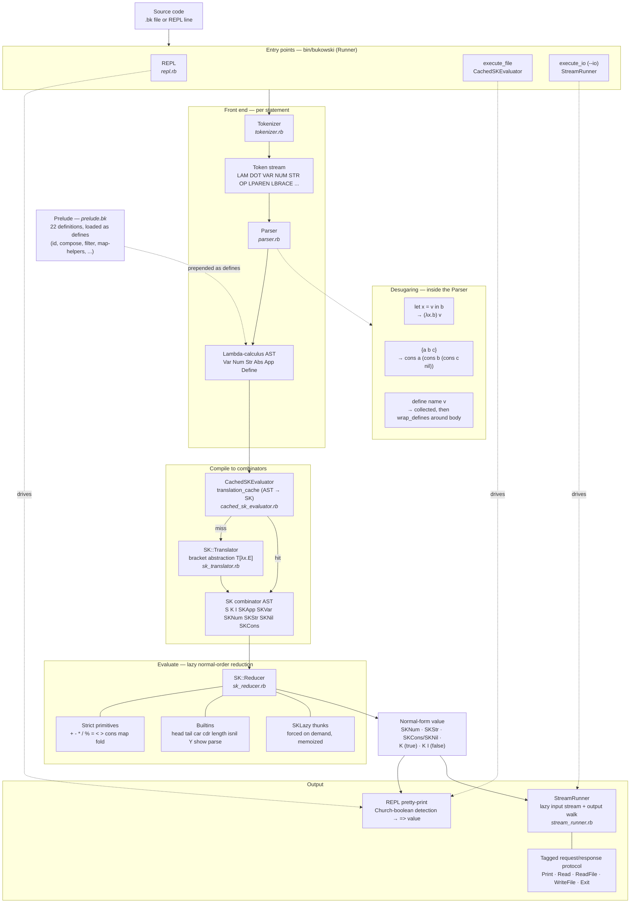

# Bukowski: A Complete Walkthrough

Bukowski is a lambda calculus language that compiles to SKI combinators
and evaluates them lazily. The name is a pun: bukowski ends in "ski."

This document walks through the entire system — what it does, how the
pieces fit together, and what it would take to use it for something
like Advent of Code.

---

## 1. What Bukowski Is

Bukowski is a pure, lazy, untyped functional language. You write lambda
calculus with some syntactic sugar (let bindings, define statements,
list literals, infix-ish operators in prefix position). The runtime
translates your code into S, K, and I combinators via bracket
abstraction, then reduces those combinators to a normal form.

It is not a practical production language. It is a working
demonstration that SKI combinators are a viable evaluation model for a
real-ish programming language, complete with strings, numbers, lists,
recursion, a standard library, and lazy stream-based IO.

### The pipeline

```
source code
    |
    v
Tokenizer  -->  token stream
    |
    v
Parser  -->  lambda calculus AST  (Var, Num, Str, Abs, App, Define)
    |
    v
SK Translator  -->  SK combinator AST  (S, K, I, SKApp, SKVar, SKNum, ...)
    |
    v
SK Reducer  -->  normal form value
    |
    v
Output (REPL pretty-print, or StreamRunner for IO programs)
```

Every expression goes through every stage. There is no interpreter that
directly evaluates the lambda calculus AST — the only evaluator is the
SK reducer.

### Architecture in detail

The diagram below maps each stage to the file that implements it, and
shows the desugaring, prelude loading, translation cache, and the two
output paths (REPL pretty-printing vs. stream IO).



---

## 2. The Language

### Syntax

```
# Lambda abstraction
\x.+ x 1           -- or λx.+ x 1

# Application is left-associative, juxtaposition
f a b               -- means (f a) b

# Operators are prefix
+ 2 3               -- 5
* 4 (+ 1 2)         -- 12

# Let binding (sugar for lambda application)
let x = 5 in + x 3  -- desugars to (\x.+ x 3) 5

# Top-level definitions
define double \x.* x 2
double 21            -- 42

# Booleans (Church-encoded)
true                 -- \t.\f.t  (selects first argument)
false                -- \t.\f.f  (selects second argument)
if cond a b          -- cond a b (if is the identity function)

# Strings
+ "hello " "world"  -- "hello world"
length "abc"         -- 3

# Lists
{1 2 3}              -- sugar for cons 1 (cons 2 (cons 3 nil))
head {1 2 3}         -- 1
tail {1 2 3}         -- {2 3}
isnil {}             -- true

# Recursion via Y combinator
define fact Y \self.\n.if (= n 0) 1 (* n (self (- n 1)))
fact 5               -- 120

# Comments
# everything after # is ignored
```

### Types (runtime, not static)

| Type     | SK node     | Examples              |
|----------|-------------|-----------------------|
| Number   | `SKNum`     | `42`, `3.14`          |
| String   | `SKStr`     | `"hello"`             |
| Boolean  | `K` / `K I` | Church-encoded        |
| List     | `SKCons`    | `{1 2 3}`             |
| Nil      | `SKNil`     | `{}`                  |
| Function | `SKApp`     | partially applied S/K |
| Lazy     | `SKLazy`    | thunks for stream IO  |

There is no static type system. Type errors are Ruby-level runtime
exceptions (`"+ : type mismatch"`, `"head: empty list"`, etc.).

---

## 3. The Tokenizer

**File:** `lib/bukowski/tokenizer.rb`

A straightforward character-by-character lexer. No dependencies.

- `\` or `λ` → `:LAM`
- `.` → `:DOT`
- `()` → `:LPAREN` / `:RPAREN`
- `{}` → `:LBRACE` / `:RBRACE`
- Digits → `:NUM` (integer or float, with lookahead for decimal point)
- Letters → `:VAR` or keyword (`:TRUE`, `:FALSE`, `:IF`, `:LET`, `:IN`, `:DEFINE`)
- `+-*/%=<>` → `:OP`
- `"..."` → `:STR` (with escape sequences: `\n`, `\t`, `\r`, `\\`, `\"`)
- `#` → comment, skip to end of line

Output is a flat array of `Token(type, value)` structs, terminated by
`:EOF`.

---

## 4. The Parser

**File:** `lib/bukowski/parser.rb`

Recursive descent, producing a lambda calculus AST.

### AST nodes

- **`Var(name)`** — variable or operator reference
- **`Num(value)`** — numeric literal
- **`Str(value)`** — string literal
- **`Abs(param, body)`** — lambda abstraction: `\param.body`
- **`App(func, arg)`** — function application (left-associative)
- **`Define(name, value)`** — top-level binding

### Key parsing rules

**`parse_expr`:** Dispatches based on the current token:
- `:LAM` → parse abstraction
- `:LET` → parse let (desugars to `App(Abs(var, body), value)`)
- `:DEFINE` → parse define
- Otherwise → parse application

**`parse_application`:** The workhorse. Parses a left-associative chain
of atoms. `f a b c` becomes `App(App(App(f, a), b), c)`. Lambda
abstractions (`:LAM`) are allowed as the final argument without
parentheses — the parser breaks after consuming one, since lambdas
extend to the right. This lets you write `Y \self.\n.body` instead
of `Y (\self.\n.body)`.

**`parse_atom`:** Handles terminals:
- Variables, operators, numbers, strings, booleans, `if`
- Parenthesized sub-expressions
- List literals: `{a b c}` desugars to nested `cons` / `nil` applications

### Define wrapping

`Parser.wrap_defines(defines, body)` takes accumulated define
statements and wraps the body expression in lambda applications:

```
define x 5
define y 10
+ x y
```

becomes:

```
(\x.(\y.+ x y) 10) 5
```

This is how definitions scope — they are not mutable environment
entries, they are lambda bindings. Each expression sees all prior
defines.

---

## 5. The SK Translator

**File:** `lib/bukowski/sk_translator.rb`

This is where lambda calculus becomes combinators. The translator
implements the **bracket abstraction** algorithm, which eliminates all
lambda abstractions by converting them to compositions of S, K, and I.

### The algorithm: T[λx.E]

Given a lambda `\x.E`, produce an SK expression with no lambdas:

| Pattern          | Result            | Intuition                                                |
|------------------|-------------------|----------------------------------------------------------|
| `T[\x.x]`       | `I`               | Identity: the body *is* the parameter                    |
| `T[\x.y]`       | `K y`             | Constant: the body ignores the parameter                 |
| `T[\x.n]`       | `K n`             | Same for literals                                        |
| `T[\x.\y.E]`    | `T[\x.T[\y.E]]`  | Translate inner first, then abstract outer               |
| `T[\x.(E F)]`   | `S T[\x.E] T[\x.F]` | S distributes the argument to both sides              |

### Optimizations

Two standard optimizations reduce combinator explosion:

- `S (K e) I` → `e` (eta reduction)
- `S (K e) (K f)` → `K (e f)` (constant folding)

Without these, translated expressions grow exponentially. With them,
output is still larger than the input but manageable.

### What S, K, I actually do

```
I x     = x                   -- identity
K x y   = x                   -- constant (discard second arg)
S x y z = (x z) (y z)         -- distribute z to both x and y
```

These three combinators are Turing-complete. Every computable function
can be expressed as a composition of S and K (I is sugar for `S K K`
but we keep it for readability).

---

## 6. The SK Reducer

**File:** `lib/bukowski/sk_reducer.rb`

The evaluator. Takes an SK expression and reduces it to normal form.

### Lazy evaluation

The reducer is **lazy**: when reducing an application `(f x)`, it
reduces `f` but does **not** reduce `x`. Arguments are only reduced
when a primitive operation needs their value (arithmetic, comparison,
list operations). This matters for:

- Church booleans: `K a b` returns `a` without ever evaluating `b`
- The Y combinator: `Y f = f (Y f)` — the recursive call `(Y f)` is
  only evaluated if `f` demands it
- Stream IO: input thunks are only forced when the program reads them

### Reduction rules

**Combinator application:**
- `I x` → reduce `x`
- `(K x) y` → reduce `x` (discard `y` without evaluating it)
- `((S x) y) z` → reduce `(x z) (y z)` (the S rule)

**Built-in variables:**
- `true` → `K`
- `false` → `K I`
- `if` → `I` (Church booleans select by application, so `if` is identity)
- `nil` → `SKNil`

**Primitive operators** (`+`, `-`, `*`, `/`, `%`, `=`, `<`, `>`):
These are **strict** — they force evaluation of both arguments.
Partially applied via `SKPartialOp`: `+ 3` becomes
`SKPartialOp('+', SKNum(3))`, waiting for a second argument.

Special cases:
- `+` on two strings: concatenation
- `=`, `<`, `>`: return Church booleans (`K` for true, `K I` for false)
- `=` across types: returns false (no error)

**Builtin functions** (`head`, `tail`, `isnil`, `length`, `Y`, `show`,
`parse`, `map`, `fold`, `cons`):

- **`cons`**: Builds an `SKCons` cell. In `lazy_cons` mode (used by
  StreamRunner), the tail is **not** reduced — this enables walking
  output one cell at a time.
- **`Y`**: The fixed-point combinator. `Y f` reduces to `f (Y f)`.
  Since evaluation is lazy, the `(Y f)` argument is not evaluated
  until `f` applies it, preventing infinite recursion.
- **`map`** and **`fold`**: Native implementations in Ruby. These are
  also available as prelude definitions written in bukowski, but the
  native versions remain for bootstrapping and performance.
- **`show`**: Converts values to strings (`SKNum(42)` → `SKStr("42")`).
- **`parse`**: Converts strings to numbers (`SKStr("42")` → `SKNum(42)`).

### SKLazy and forcing

`SKLazy` wraps a Ruby `Proc`. The reducer treats it as a value — it
does not force it automatically. Forcing happens in two places:

1. **Strict positions**: when a primitive operator or builtin needs the
   actual value, the reducer calls `force(expr)` which unwraps all
   `SKLazy` layers.
2. **StreamRunner**: when walking the output list, `force_reduce`
   forces and then reduces each cons cell.

Forced values are memoized — the thunk runs at most once.

---

## 7. The Cached Evaluator

**File:** `lib/bukowski/cached_sk_evaluator.rb`

Glues the pipeline together: tokenize → parse → translate → reduce.

### Translation caching

The `@translation_cache` memoizes LC-to-SK translations by AST
identity. This matters in the REPL where the same define bodies get
re-translated on every expression.

### Multi-statement programs

`evaluate_program(source)` handles files and REPL sessions:

1. Split source into statements (respecting paren/brace nesting across
   lines)
2. For each statement:
   - If it's a `Define`: accumulate it
   - Otherwise: wrap in all prior defines (as lambda bindings), evaluate
3. Return array of results

The `prelude_defines` parameter prepends the standard library's defines
before user code.

---

## 8. The Prelude

**Files:** `lib/bukowski/prelude.bk`, `lib/bukowski/prelude.rb`

The standard library, written in bukowski itself. Loaded automatically
before user code (unless `--no-prelude` is passed).

### 22 definitions

**Combinators:**
```
define id       \x.x
define const    \x.\y.x
define compose  \f.\g.\x.f (g x)
define flip     \f.\x.\y.f y x
define apply    \f.\x.f x
```

**Boolean operations** (on Church booleans):
```
define not  \b.b false true
define and  \a.\b.a b false
define or   \a.\b.a true b
```

**Church pairs:**
```
define pair  \a.\b.\f.f a b
define fst   \p.p \a.\b.a
define snd   \p.p \a.\b.b
```

**List utilities** (all recursive via Y combinator):
```
define filter  (Y \self.\f.\xs.if (isnil xs) {} (if (f (head xs)) ...))
define append  (Y \self.\xs.\ys.if (isnil xs) ys (cons (head xs) ...))
define reverse (Y \self.\xs.if (isnil xs) {} (append (self (tail xs)) ...))
define nth     (Y \self.\n.\xs.if (= n 0) (head xs) (self (- n 1) ...))
define take    (Y \self.\n.\xs.if (= n 0) {} ...)
define drop    (Y \self.\n.\xs.if (= n 0) xs ...)
define zip     (Y \self.\xs.\ys.if (isnil xs) {} ...)
define any     (Y \self.\f.\xs.if (isnil xs) false ...)
define all     (Y \self.\f.\xs.if (isnil xs) true ...)
define sum     (fold + 0)
define product (fold * 1)
```

Every recursive function uses the Y combinator explicitly — there is
no built-in recursion mechanism in the language. `Y \self.\args.body`
gives `self` as a recursive reference to the function being defined.

### How prelude loading works

`Prelude.load_defines(evaluator)` reads `prelude.bk`, runs it through
`evaluate_program`, and collects the resulting `Define` AST nodes. These
are then prepended to the user's defines so every user expression can
reference prelude functions.

---

## 9. The REPL

**File:** `lib/bukowski/repl.rb`

Interactive read-eval-print loop with the `λ>` prompt.

- Multi-line input: tracks paren/brace depth, continues on `..` prompt
  until balanced
- Accumulates defines across the session
- Pretty-prints Church booleans as `true`/`false` instead of `K`/`K I`
- Loads prelude on startup (unless `--no-prelude`)

---

## 10. Stream IO

**Files:** `lib/bukowski/stream_runner.rb`, `IO_PLAN.md`

### The model

Bukowski programs are pure. IO is handled at the boundary: a program is
a function `[String] -> [String]` (or more precisely,
`[Response] -> [Request]`). The Ruby runtime drives it.

This is the pre-monadic Haskell / Miranda model of IO.

### StreamRunner

The runner:

1. Evaluates the program source, collecting defines
2. If the result is already a list (SKCons/SKNil), walks it directly
3. Otherwise, applies the program to a **lazy input list** and walks
   the output

The lazy input list is a chain of `SKLazy` thunks. Each thunk, when
forced, reads a line from stdin (or the response queue) and returns an
`SKCons` cell whose tail is another `SKLazy` thunk. Input is only read
when the program demands it.

### The request/response protocol

Output list elements can be plain strings (printed directly) or tagged
cons cells:

| Tag         | Meaning                                | Response pushed to input |
|-------------|----------------------------------------|--------------------------|
| `Print msg` | Write `msg` to stdout                  | (none)                   |
| `Read`      | Read a line from stdin                 | the line read            |
| `ReadFile p` | Read file at path `p`                 | file contents            |
| `WriteFile p c` | Write `c` to file at path `p`     | empty string             |
| `Exit code` | Terminate with exit code               | (terminates)             |

The `lazy_cons` mode in the reducer is critical here: without it, the
entire output list would be forced during evaluation, causing all reads
to fire before any responses are available. With `lazy_cons: true`,
cons cells don't reduce their tails, so the runner walks the output one
cell at a time, dispatching requests and pushing responses between
steps.

### Example IO program

```
define main \input.
  cons "What is your name?"
    (cons (+ "Hello, " (head input))
      {})

main
```

Run with `bukowski --io program.bk`:
1. Runtime walks output: first element is `"What is your name?"` → prints it
2. Second element needs `(head input)` → forces the lazy thunk → reads
   from stdin
3. Concatenates, prints `"Hello, Alice"`
4. Tail is `{}` → program ends

---

## 11. Execution Modes

**File:** `bin/bukowski`

Three modes:

| Invocation                    | Mode          | What happens                                      |
|-------------------------------|---------------|---------------------------------------------------|
| `bukowski`                    | REPL          | Interactive λ> prompt                             |
| `bukowski file.bk`           | File          | Evaluate, print final result                      |
| `bukowski --io file.bk`      | Stream IO     | Run as IO program with request/response protocol  |

All modes accept `--no-prelude` to skip loading the standard library.

---

## 12. The Test Suite

234 tests across 9 files. All use minitest.

| File                      | Tests | What it covers                                    |
|---------------------------|-------|---------------------------------------------------|
| `test_bukowski.rb`        | 1     | Version constant exists                           |
| `test_tokenizer.rb`       | 7     | Lexing: lambdas, parens, numbers, keywords, ops   |
| `test_parser.rb`          | 10    | Parsing: exprs, ops, booleans, if, lambda-as-arg  |
| `test_sk_ast.rb`          | 14    | Node equality, to_s, SKLazy memoization           |
| `test_sk_translator.rb`   | 17    | Bracket abstraction: I, K, S, optimizations       |
| `test_sk_reducer.rb`      | 66    | Reduction: combinators, primitives, builtins, lazy |
| `test_integration.rb`     | 40    | End-to-end: source → result                       |
| `test_stream_runner.rb`   | 25    | IO: streams, requests, file IO, exit codes        |
| `test_prelude.rb`         | 54    | All 22 prelude functions + show/parse              |

---

## 13. Design Decisions and Their Consequences

### SKI combinators as the sole evaluator

Every lambda is translated to S, K, I compositions. There is no
environment, no closure object, no call stack. This is elegant and
minimal but has real costs:

- **Performance**: bracket abstraction causes quadratic-to-exponential
  growth in expression size. `\x.\y.\z.body` produces deeply nested S
  and K trees. Each reduction step pattern-matches through several
  layers of SKApp. This is orders of magnitude slower than a direct
  evaluator with an environment.
- **Debuggability**: when something goes wrong, you are staring at
  `S (K (S I)) (S (K K) I)`, not `\x.x`. Error messages reference SK
  structures, not source-level variables.
- **No continuations**: algebraic effects and call/cc require an
  explicit call stack, which SKI evaluation doesn't have. This was
  explored (see `EFFECTS_PROPOSAL.md`) and deliberately abandoned.

The tradeoff is worth it for bukowski's purpose: exploring how far you
can push a pure combinator-based evaluator.

### Lazy evaluation

The reducer does not evaluate arguments before passing them to
functions. Only primitive operations (arithmetic, comparisons) force
their arguments. This gives us:

- Church booleans that actually short-circuit (`K a b` never
  evaluates `b`)
- A working Y combinator without special-casing
- Stream IO that reads input on demand

The cost: you cannot easily add strict-by-default evaluation or detect
infinite loops.

### Church-encoded booleans

`true` is `K` (select first), `false` is `K I` (select second), `if`
is `I` (identity — just applies the boolean to two branches). This is
the standard Church encoding, and it works because of lazy evaluation.

The cost: booleans are not a distinct type. `K` is both "true" and "the
K combinator." The REPL has special-case detection to print `true`
instead of `K`, but in data structures the distinction is lost.

### Prefix-only syntax

All operators are prefix: `+ 2 3`, not `2 + 3`. This keeps the parser
dead simple (no precedence, no associativity for operators). The cost
is readability for complex arithmetic — `+ (* 2 x) (- y 1)` takes
getting used to.

---

## 14. The Issue History

Bukowski's development is tracked in `.beads/issues/`. All 12 issues
are now closed:

| ID  | Title                           | Status        |
|-----|---------------------------------|---------------|
| 1   | String concatenation with +     | closed        |
| 2   | String equality with =          | closed        |
| 3   | String ordering with < >        | closed        |
| 4   | Length builtin                   | closed        |
| 5   | Define for top-level bindings   | closed        |
| 6   | Closures                        | closed (SK handles it) |
| 7   | Continuations                   | wontfix (incompatible with SKI) |
| 8   | Algebraic effects               | wontfix (requires continuations) |
| 9   | Prelude / standard library      | closed        |
| 10  | SKLazy node                     | closed        |
| 11  | Stream IO runner                | closed        |
| 12  | Request/response IO protocol    | closed        |

The wontfix on 7 and 8 is a defining moment: bukowski committed to
being a lazy-streams language rather than an effects language. This
keeps the SKI core intact at the cost of expressive IO.

---

## 15. Could Bukowski Solve Advent of Code?

Short answer: some problems, with effort. Many problems, not yet. Here
is an honest assessment.

### What bukowski can do today

- **Pure computation on numbers**: arithmetic, comparisons, recursion
  via Y combinator. Anything that is a mathematical function from
  inputs to outputs.
- **List processing**: map, fold, filter, reverse, append, take, drop,
  nth, zip, any, all, sum, product. This covers a lot of AoC.
- **String handling**: concatenation, equality, comparison, length,
  show (number to string), parse (string to number).
- **IO**: read files, write output. The request/response protocol can
  read puzzle input from a file.
- **Recursion**: Y combinator works, and prelude functions demonstrate
  complex recursive algorithms.

### A realistic AoC attempt

**Day 1-style "parse numbers, do arithmetic"**: Possible today, but
painful. You can read the file, but you cannot split a string on
newlines or whitespace. You would need to write a character-level
parser using only string concatenation and comparison.

**"Process a list of integers"**: If the input were already a bukowski
list, many problems would be straightforward. The gap is parsing —
turning a text file into structured data.

**Grid/2D problems**: Not feasible. No arrays, no random access. Lists
give you O(n) access to the nth element. A 100x100 grid lookup in a
nested list would be catastrophically slow even if the language were
fast — and it is not fast.

**Graph problems**: Theoretically possible with adjacency lists as
lists of pairs, but the performance would be unusable. No hash maps,
no sets, no mutable state for visited tracking.

**Dynamic programming**: Requires memoization or arrays. Neither exists.
You can use the Y combinator for recursion, but without memoization,
exponential-time DP solutions stay exponential.

### What's missing: a prioritized list

Here is what bukowski would need, roughly in order of impact, to be
practical for AoC-style problems.

#### Tier 1: Essential for any real use

**1. String splitting and character access**

This is the single biggest gap. You cannot parse puzzle input without
being able to split a string on a delimiter or access individual
characters.

Needed builtins:
- `chars "hello"` → `{"h" "e" "l" "l" "o"}` (string to list of
  single-char strings)
- `split "\n" "a\nb\nc"` → `{"a" "b" "c"}` (split on delimiter)
- `join "\n" {"a" "b" "c"}` → `"a\nb\nc"` (join with delimiter)
- `substr start len str` → substring extraction

With `chars` alone, you could write `split` and `join` in the prelude.
This is the minimum viable addition.

**2. Negative numbers and unary minus**

The tokenizer does not handle negative number literals. You can write
`- 0 5` to get -5, but `parse "-7"` works at the reducer level. The
parser should handle `-7` as a token.

**3. Multi-line string / heredoc or raw file read**

`ReadFile` returns a single string, but without `split`, you cannot
break it into lines. This is blocked by #1 above.

#### Tier 2: Needed for medium-difficulty problems

**4. Hash maps / dictionaries**

Many AoC problems require O(1) lookup. Without a native hash/dict
type, you are limited to association lists with O(n) lookup. Possible
approaches:
- Native `SKMap` with `insert`, `lookup`, `keys`, `values` builtins
- Or: balanced BST in the prelude (possible but very slow via SK)

**5. Sets**

Needed for "have I seen this before?" problems. Could be implemented
on top of hash maps.

**6. Integer division and modular arithmetic**

`/` exists but does Ruby integer division. `%` exists. These work but
you might also want:
- `abs` — absolute value
- `min` / `max` — on two values (writable in prelude with `if`)
- `divmod` — quotient and remainder together

Some of these can go in the prelude today:
```
define abs \n.if (< n 0) (- 0 n) n
define min \a.\b.if (< a b) a b
define max \a.\b.if (> a b) a b
```

**7. Tuples / records**

Church pairs work but nesting them for 3+ fields is painful:
`pair a (pair b (pair c nil))` and extracting with
`fst (snd (snd x))`. A lightweight tuple syntax like `(a, b, c)`
and pattern matching would help.

#### Tier 3: Needed for hard problems

**8. Mutable arrays or random-access sequences**

Grid problems, DP, BFS on implicit graphs — all need O(1) or O(log n)
indexed access. Options:
- Native `SKArray` with `get`, `set`, `make` builtins
- Persistent vectors (Clojure-style, 32-way tries) — complex to
  implement in SK
- Accept O(n) list access and limit yourself to small inputs

**9. Mutable state or persistent data structures**

Tracking "visited" nodes, accumulating into a map, updating a grid
cell — all require either mutable state (which breaks purity) or
efficient persistent data structures (which are complex).

**10. Pattern matching**

Destructuring lists and pairs is currently manual (`head`, `tail`,
`fst`, `snd`). Pattern matching would make recursive list processing
much more readable:
```
define length
  | {} -> 0
  | (cons _ xs) -> + 1 (length xs)
```

**11. Error handling**

Currently, errors are Ruby-level `raise`. No way to catch errors in
bukowski. For AoC you occasionally need "try this, if it fails, try
that" logic. Options:
- Maybe/Option type (encodable today with Church encoding, but verbose)
- Native try/catch

**12. Performance**

This is the elephant in the room. SKI combinator reduction is
inherently slow:
- Bracket abstraction blows up expression size
- Each S reduction duplicates sub-expressions
- No tail-call optimization
- No compilation to bytecode or native code

For AoC, many problems have inputs of 1000+ lines with O(n log n) or
O(n^2) expected solutions. Bukowski would likely time out on anything
beyond small inputs.

Possible mitigations:
- **Supercombinators**: compile to G-machine style supercombinators
  instead of raw S/K/I. This is what real lazy languages (GHC) do.
- **Graph reduction**: share sub-expressions instead of duplicating
  them during S reduction.
- **Strictness analysis**: detect arguments that will always be
  forced and evaluate them eagerly, avoiding thunk overhead.

These are substantial implementation efforts — each one is a research
project.

#### Tier 4: Quality of life

**13. Better error messages**

Currently errors say things like `"Expected RPAREN, but found LAM"` or
`"head: empty list"`. Source locations, stack traces in terms of
user-defined names, and "did you mean?" suggestions would help.

**14. Multi-parameter lambdas**

`\x y z.body` instead of `\x.\y.\z.body`. Pure sugar, easy to add
in the parser.

**15. Infix operators**

At least optional: `2 + 3` as well as `+ 2 3`. Would require
precedence parsing (Pratt parser or similar).

**16. Module system / imports**

`include "utils.bk"` for splitting code across files.

**17. Standard library expansion**

Even without new builtins, the prelude could grow:
- `range start end` → `{start start+1 ... end-1}`
- `enumerate xs` → `{(pair 0 x0) (pair 1 x1) ...}`
- `sortBy cmp xs` (merge sort in bukowski — possible but slow)
- `groupBy f xs`
- `concatMap f xs` (flatMap)
- `replicate n x` → list of n copies of x
- `iterate f x` → `{x (f x) (f (f x)) ...}` (lazy infinite list)

### Verdict

**Could bukowski solve AoC today?** A few Day 1-2 level problems,
if they involve pure arithmetic or list processing on pre-parsed
integer lists. Anything requiring string parsing, grid access, hash
lookups, or performance on large inputs is out of reach.

**What's the minimum to make it viable for ~25% of AoC?**
Add `chars` and `split` builtins (Tier 1), plus `min`/`max`/`abs`/
`range` in the prelude (Tier 2 — some of which can be written today).
This gets you string parsing, which unlocks the "parse input, process
list, compute answer" pattern that covers many early AoC days.

**What about 50%+ of AoC?**
You need hash maps and reasonable performance. That is a much larger
investment.

**Should bukowski try to be an AoC language?** Probably not as a
primary goal — that would push it toward being a general-purpose
language, which is not what it is. But "can it solve AoC Day N?" is a
great forcing function for finding gaps and prioritizing improvements.
Each AoC problem you attempt will reveal exactly what's missing, in
order of pain.

---

## Appendix: File Map

```
bukowski/
  bin/
    bukowski              # CLI entry point (90 lines)
  lib/
    bukowski/
      tokenizer.rb        # Lexer (152 lines)
      parser.rb           # Parser → LC AST (182 lines)
      sk_ast.rb           # SK node types (196 lines)
      sk_translator.rb    # Bracket abstraction (144 lines)
      sk_reducer.rb       # SK evaluator (307 lines)
      cached_sk_evaluator.rb  # Pipeline glue + caching (85 lines)
      prelude.rb          # Prelude loader (17 lines)
      prelude.bk          # Standard library in bukowski (36 lines)
      repl.rb             # Interactive REPL (90 lines)
      stream_runner.rb    # IO driver (165 lines)
      version.rb          # Version constant
    bukowski.rb           # Top-level require
  test/
    test_bukowski.rb      # 1 test
    test_tokenizer.rb     # 7 tests
    test_parser.rb        # 10 tests
    test_sk_ast.rb        # 14 tests
    test_sk_translator.rb # 17 tests
    test_sk_reducer.rb    # 66 tests
    test_integration.rb   # 40 tests
    test_stream_runner.rb # 25 tests
    test_prelude.rb       # 54 tests
  .beads/issues/          # 12 tracked issues (all closed)
  IO_PLAN.md              # Lazy stream IO design
  EFFECTS_PROPOSAL.md     # Algebraic effects exploration (abandoned)
  README.md               # Project overview
```

**Total:** ~1,450 lines of Ruby source, 36 lines of bukowski prelude,
~2,000 lines of tests, 234 passing tests.
